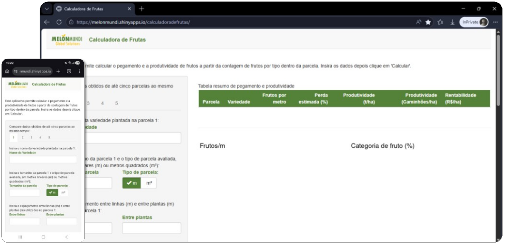
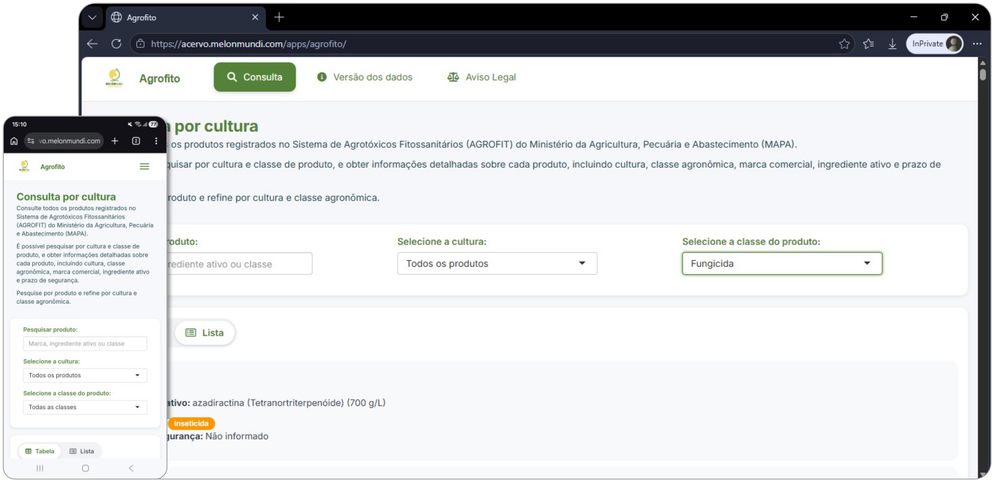
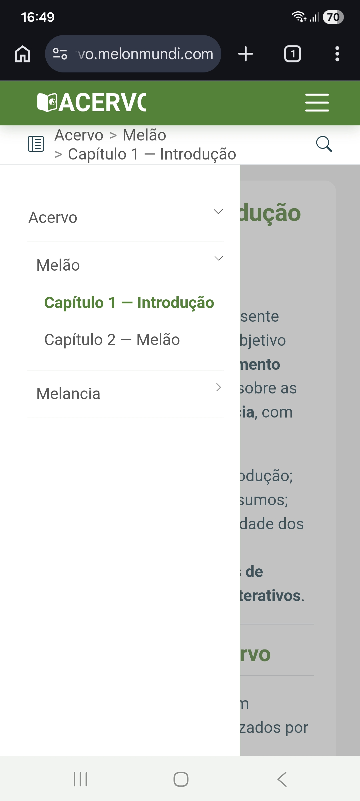

---
title: "Página Inicial"
description: "Ecossistema MelonMundi para conteúdo técnico, apps especializados e decisão agrícola orientada por dados em melão e melancia."
body-classes: home-page home-at-top
---

<section class="column-screen screen-home-hero">

Bem-vindo à MelonMundi!

<h1 class="hero-title">Somos um grupo multidisciplinar com
dedicação exclusiva às culturas de melão,
melancia e abóbora</h1>

Assessoramos desde o planejamento de uma fazenda produtora até a etapa final de transporte do produto. Tenha acesso a contéudo exclusivo e aplicativos práticos para a rotina de campo.

<a class="btn btn-hero-secondary" href="sobre-nos.qmd"><i class="fa-solid fa-users"></i> Quem Somos</a>

</section>

<section class="column-screen screen-white">

Oferecemos soluções inovadoras para melhorar o dia a dia do agricultor

<button class="mm-carousel-btn prev" type="button" data-carousel-prev="ofertas" aria-label="Anterior"><i class="fa-solid fa-chevron-left"></i></button>

<article class="mm-slide">

<i class="fa-solid fa-book-open-reader card-icon"></i><h3>Biblioteca Técnica</h3>
Explore conteúdo técnico estruturado em guias práticos de manejo, irrigação, nutrição e fitossanidade para as culturas de melão e melancia.

</article>
<article class="mm-slide">

<i class="fa-solid fa-mobile-screen-button card-icon"></i><h3>Aplicativos</h3>
Tenha à disposição aplicativos que auxiliam na tomada de decisões.

</article>
<article class="mm-slide">

<i class="fa-solid fa-user-check card-icon"></i><h3>Login único</h3>
Faça login com uma única autenticação para acessar a biblioteca e todos os aplicativos disponibilizados pela MelonMundi.

</article>

<button class="mm-carousel-btn next" type="button" data-carousel-next="ofertas" aria-label="Próximo"><i class="fa-solid fa-chevron-right"></i></button>

</section>

<section class="column-screen screen-accent screen-app-featured">

Aplicativos MelonMundi

Acesse os aplicativos exclusivos no computador, tablet ou celular e tenha recomendações técnicas, cálculos e dados em tempo real para auxilar nas suas decisões no campo.

 

<button class="mm-carousel-btn prev" type="button" data-carousel-prev="apps-featured" aria-label="Anterior"><i class="fa-solid fa-chevron-left"></i></button>

<article class="mm-slide">

<h3>Acesso contínuo 24/7</h3>

Aplicativos disponíveis 24 horas por dia, 7 dias por semana, para apoiar consultas e decisões técnicas no momento em que a equipe precisar.

Disponibilidade contínua

</article>
<article class="mm-slide">

<h3>Agrofito</h3>

Consulte os produtos registrados no Sistema de Agrotóxicos Fitossanitários (AGROFIT) do Ministério da Agricultura e Pecuária (MAPA), com foco em Melão, Melancia e Todas as culturas. A base de dados é atualizada continuamente.

Base oficial AGROFIT

</article>
<article class="mm-slide">

<h3>Calculadora de Frutas (Em construção)</h3>

Estimativa de pegamento e produtividade de melancia para apoiar ajustes de manejo e projeção de colheita.

Estimativa produtiva

</article>
<article class="mm-slide">

<h3>Novos apps em evolução</h3>

O ecossistema está em expansão contínua, com novas soluções para monitoramento, recomendação e validação técnica.

Roadmap ativo

</article>

<button class="mm-carousel-btn next" type="button" data-carousel-next="apps-featured" aria-label="Próximo"><i class="fa-solid fa-chevron-right"></i></button>

</section>

<section class="column-screen screen-white screen-acervo-showcase">

Biblioteca MelonMundi

Acesse protocolos, recomendações de manejo e análises de campo em um só lugar, com conteúdos validados por especialistas em cucurbitáceas.

 

<article class="acervo-feature-item">
<i class="fa-solid fa-book-open-reader"></i>

<h3>Conteúdo sob demanda</h3>

Tenha acesso a conteúdo técnico exclusivo sobre **melão** e **melancia**.

</article>
<article class="acervo-feature-item">
<i class="fa-solid fa-seedling"></i>

<h3>Manejo e recomendações técnicas</h3>

Conteúdos organizados sobre manejo, irrigação, fertilização e controle fitossanitário para orientar a rotina de campo.

</article>
<article class="acervo-feature-item">
<i class="fa-solid fa-clock"></i>

<h3>Acesso 24 horas, 7 dias por semana</h3>

O Acervo MelonMundi fica disponível a qualquer momento para consulta rápida, estudo e suporte à tomada de decisão.

</article>

<a class="btn app-link-btn" href="https://acervo.melonmundi.com"><i class="fa-solid fa-lock"></i> Entrar no Acervo</a>

</section>

<section class="column-screen screen-primary">

Como funciona o acesso

1
<h3>Conheça o site público</h3>
Entenda o posicionamento da MelonMundi, equipe e soluções técnicas para cucurbitáceas.

2
<h3>Faça login único</h3>
Use sua autenticação para entrar no acervo e habilitar acesso aos aplicativos restritos.

3
<h3>Acesse conteúdo + apps</h3>
Consulte materiais técnicos e ferramentas digitais em um único fluxo de trabalho.

<a class="btn btn-hero-secondary" href="https://acervo.melonmundi.com"><i class="fa-solid fa-arrow-right-to-bracket"></i> Ir para o Acervo</a>

</section>

