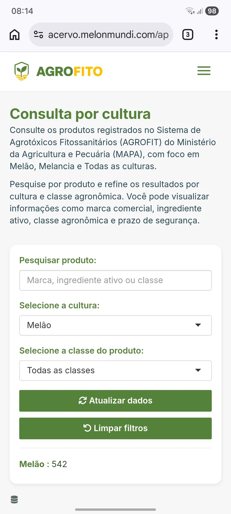
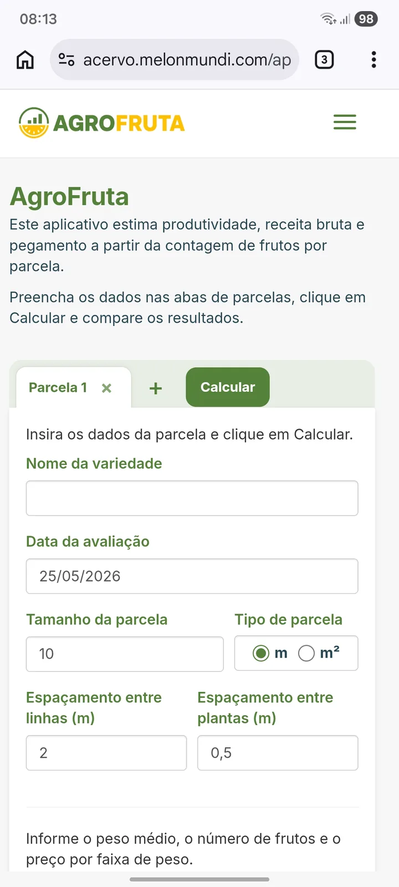
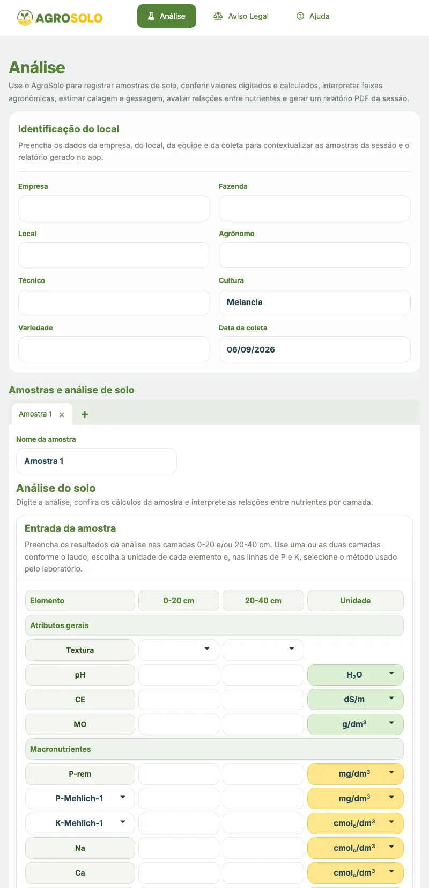
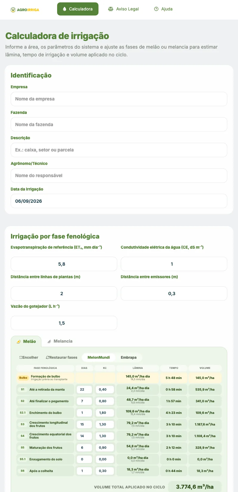

::: {.column-screen .screen-home-hero}
::: {.column-body}

<i class="fa-solid fa-leaf" aria-hidden="true"></i> Bem-vindo à MelonMundi

<h1 class="hero-title">Ciência, campo e dados a serviço do melão, da melancia e da abóbora</h1>

Somos um grupo multidisciplinar com dedicação exclusiva às cucurbitáceas. Assessoramos do planejamento da fazenda ao transporte do produto — e reunimos todo esse conhecimento em um acervo digital com biblioteca técnica, simuladores e aplicativos. Também capacitamos equipes no próprio campo.

<a class="btn btn-mm btn-mm-amber" href="https://acervo.melonmundi.com"><i class="fa-solid fa-arrow-right-to-bracket" aria-hidden="true"></i> Entrar no Acervo</a>
<a class="btn btn-mm btn-mm-ghost" href="#ecossistema"><i class="fa-solid fa-compass" aria-hidden="true"></i> Ver o que oferecemos</a>

<ul class="hero-highlights reveal" aria-label="Destaques do ecossistema MelonMundi">
<li><i class="fa-solid fa-book-open-reader" aria-hidden="true"></i><strong>Biblioteca técnica</strong>Artigos, protocolos e fichas</li>
<li><i class="fa-solid fa-calculator" aria-hidden="true"></i><strong>4 simuladores</strong>Cálculo e consulta on-line</li>
<li><i class="fa-solid fa-mobile-screen-button" aria-hidden="true"></i><strong>Aplicativos</strong>Ferramentas para a rotina</li>
<li><i class="fa-solid fa-person-chalkboard" aria-hidden="true"></i><strong>Capacitação técnica</strong>Treinamento na fazenda, com certificado</li>
</ul>

<a class="hero-scroll-hint" href="#ecossistema" aria-label="Avançar para o conteúdo"></a>

:::
:::

::: {.column-screen .screen-band}
::: {.column-body}

3culturas com dedicação exclusiva

4simuladores agronômicos on-line

2programas de capacitação técnica

24/7Acervo disponível 24 horas por dia, 7 dias por semana

:::
:::

::: {.column-screen .screen-white #ecossistema}
::: {.column-body}

Tudo em um só lugar

<h2 class="section-title reveal">O ecossistema MelonMundi</h2>

Um login único abre a porta para conteúdo técnico, ferramentas de cálculo, aplicativos e capacitação — todos construídos a partir da nossa experiência de campo em cucurbitáceas.

<article class="feature-card">

<i class="fa-solid fa-book-bookmark"></i>

<h3>Biblioteca</h3>

Artigos técnicos, protocolos de manejo e fichas de campo organizados por tema, com busca e filtros por cultura e palavra-chave.

<ul class="feature-tags"><li>Artigos</li><li>Protocolos</li><li>Fichas técnicas</li></ul>
</article>

<article class="feature-card">

<i class="fa-solid fa-calculator"></i>

<h3>Simuladores</h3>

Ferramentas on-line para consultar, calcular e simular cenários: fitossanidade, produtividade, solo e irrigação.

<ul class="feature-tags"><li>AgroFito</li><li>AgroFruta</li><li>AgroSolo</li><li>AgroIrriga</li><li class="feature-tag-soon">Em desenvolvimento: AgroMix e AgroFerti</li></ul>
</article>

<article class="feature-card">

<i class="fa-solid fa-mobile-screen-button"></i>

<h3>Aplicativos</h3>

Programas instaláveis no computador ou no celular, pensados para registrar informações e apoiar o trabalho técnico no campo.

<ul class="feature-tags"><li>AgroJornal</li><li>Em evolução</li></ul>
</article>

<article class="feature-card">

<i class="fa-solid fa-chart-line"></i>

<h3>Painel analítico</h3>

Dashboards e indicadores que consolidam informações autorizadas e transformam dados de campo em apoio à decisão.

<ul class="feature-tags"><li>Indicadores</li><li>Em construção</li></ul>
</article>

<article class="feature-card">

<i class="fa-solid fa-person-chalkboard"></i>

<h3>Capacitação técnica</h3>

Treinamento de equipes nas próprias fazendas, com teoria aplicada ao manejo e atividades práticas acompanhadas pela equipe técnica.

<ul class="feature-tags"><li>Monitores em MIPD</li><li>Imersão no manejo</li><li>Na fazenda</li></ul>
</article>

<article class="feature-card">

<i class="fa-solid fa-award"></i>

<h3>Certificados</h3>

Emissão de certificados após a validação das atividades práticas pela equipe técnica — não apenas pela presença.

<ul class="feature-tags"><li>Validação técnica</li><li>Consulta on-line</li></ul>
</article>

:::
:::

::: {.column-screen .screen-accent}
::: {.column-body}

Conhecimento organizado

<h2 class="section-title reveal">Biblioteca técnica</h2>

Conteúdo produzido e revisado por quem está no campo, estruturado em três formatos que se complementam: o artigo explica, o protocolo padroniza e a ficha vai para a mão do avaliador.

<article class="library-card">

<i class="fa-solid fa-newspaper" aria-hidden="true"></i> Artigos
<h3>Fundamento técnico</h3>

Textos aprofundados sobre fitossanidade, distúrbios fisiológicos e manejo, com imagens de campo e referências.

<ul class="library-list">
<li><i class="fa-solid fa-bug" aria-hidden="true"></i> Lagartas em cucurbitáceas</li>
<li><i class="fa-solid fa-virus" aria-hidden="true"></i> Fusarium</li>
<li><i class="fa-solid fa-droplet" aria-hidden="true"></i> Vidrado (distúrbio fisiológico)</li>
</ul>
</article>

<article class="library-card library-card-featured">

<i class="fa-solid fa-clipboard-list" aria-hidden="true"></i> Protocolos
<h3>Rotina padronizada</h3>

Procedimentos MIPD em três níveis, com versões específicas para melão e para melancia, do reconhecimento em campo ao uso do simulador.

<ul class="library-list">
<li><i class="fa-solid fa-1" aria-hidden="true"></i> Reconhecimento e monitoramento em campo</li>
<li><i class="fa-solid fa-2" aria-hidden="true"></i> Cálculos e consolidação de dados</li>
<li><i class="fa-solid fa-3" aria-hidden="true"></i> Digitação e uso do simulador</li>
</ul>
</article>

<article class="library-card">

<i class="fa-solid fa-file-lines" aria-hidden="true"></i> Fichas técnicas
<h3>Apoio na mão</h3>

Resumos derivados dos protocolos, prontos para impressão e consulta rápida durante a avaliação na área.

<ul class="library-list">
<li><i class="fa-solid fa-file-pdf" aria-hidden="true"></i> Versões em PDF para o campo</li>
<li><i class="fa-solid fa-filter" aria-hidden="true"></i> Filtros por tema e cultura</li>
<li><i class="fa-solid fa-magnifying-glass" aria-hidden="true"></i> Busca em toda a biblioteca</li>
</ul>
</article>

<a class="btn btn-mm btn-mm-green" href="https://acervo.melonmundi.com"><i class="fa-solid fa-arrow-right-to-bracket" aria-hidden="true"></i> Acessar a biblioteca</a>

Conteúdo disponível para usuários autenticados no Acervo MelonMundi.

:::
:::

::: {.column-screen .screen-white .screen-simuladores}
::: {.column-body}

Contas e decisões em minutos

<h2 class="section-title reveal">Simuladores MelonMundi</h2>

Rodam direto no navegador, no computador ou no celular. Os dados informados são temporários: nada permanece armazenado depois que a sessão é encerrada.

<article class="sim-card">

Consulta de produtos fitossanitários registrados no AGROFIT/MAPA, com foco em melão, melancia e todas as culturas.

Base oficial AGROFIT
</article>

<article class="sim-card">

Estimativa de produtividade, receita bruta e pegamento a partir da contagem de frutos por parcela.

Produtividade e rentabilidade
</article>

<article class="sim-card">

Interpretação de análise de solo, faixas agronômicas, calagem, gessagem e relatório da sessão em PDF.

Interpretação e recomendação
</article>

<article class="sim-card">

Cálculo de lâmina, tempo de irrigação e volume aplicado por fase fenológica de melão e melancia.

Planejamento de irrigação
</article>

:::
:::

::: {.column-screen .screen-showcase}
::: {.column-body}

<h2 class="section-title section-title-light reveal">Veja como funciona na prática</h2>

Interfaces pensadas para o dia a dia: poucos campos, resultado imediato e leitura confortável no celular.

<button class="mm-carousel-btn prev" type="button" data-carousel-prev="simuladores" aria-label="Simulador anterior"><i class="fa-solid fa-chevron-left" aria-hidden="true"></i></button>

<article class="mm-slide">

<h3>AgroFito</h3>

Pesquise por marca comercial, ingrediente ativo ou classe agronômica e refine por cultura. A base do AGROFIT/MAPA é atualizada continuamente e mostra também o prazo de segurança de cada produto.

<ul class="showcase-points">
<li><i class="fa-solid fa-check" aria-hidden="true"></i> Filtros por cultura e classe</li>
<li><i class="fa-solid fa-check" aria-hidden="true"></i> Marca, ingrediente ativo e carência</li>
</ul>

</article>

<article class="mm-slide">

<h3>AgroFruta</h3>

Informe os dados da parcela — espaçamento, contagem de frutos, peso médio e preço por faixa — e compare cenários de produtividade, receita bruta e pegamento entre parcelas.

<ul class="showcase-points">
<li><i class="fa-solid fa-check" aria-hidden="true"></i> Várias parcelas lado a lado</li>
<li><i class="fa-solid fa-check" aria-hidden="true"></i> Categorias de fruto e receita</li>
</ul>

</article>

<article class="mm-slide">

<h3>AgroSolo</h3>

Registre amostras, confira valores digitados e calculados, interprete faixas agronômicas, estime calagem e gessagem, avalie relações entre nutrientes e gere um relatório em PDF da sessão.

<ul class="showcase-points">
<li><i class="fa-solid fa-check" aria-hidden="true"></i> Camadas 0–20 e 20–40 cm</li>
<li><i class="fa-solid fa-check" aria-hidden="true"></i> Relatório em PDF</li>
</ul>

</article>

<article class="mm-slide">

<h3>AgroIrriga</h3>

Informe a área e os parâmetros do sistema, ajuste as fases fenológicas de melão ou melancia e obtenha lâmina, tempo de irrigação e volume aplicado ao longo de todo o ciclo.

<ul class="showcase-points">
<li><i class="fa-solid fa-check" aria-hidden="true"></i> Fases fenológicas ajustáveis</li>
<li><i class="fa-solid fa-check" aria-hidden="true"></i> Volume total do ciclo</li>
</ul>

</article>

<button class="mm-carousel-btn next" type="button" data-carousel-next="simuladores" aria-label="Próximo simulador"><i class="fa-solid fa-chevron-right" aria-hidden="true"></i></button>

:::
:::

::: {.column-screen .screen-white}
::: {.column-body}

Capacitação técnica

<h2 class="section-title section-title-left">Treinamento de equipes no campo</h2>

Capacitamos técnicos, monitores e equipes de campo na própria fazenda, unindo teoria aplicada e prática nas áreas de produção de melão e melancia.

<i class="fa-solid fa-certificate" aria-hidden="true"></i> O certificado é emitido depois que a equipe técnica valida a atividade prática — não pela simples presença.

<ul class="course-modules course-programs">
<li><i class="fa-solid fa-bug" aria-hidden="true"></i> Formação de Monitores em MIPD</li>
<li><i class="fa-solid fa-seedling" aria-hidden="true"></i> Imersão no manejo de melão e melancia</li>
</ul>

:::
:::

::: {.column-screen .screen-accent}
::: {.column-body}

Em desenvolvimento

<h2 class="section-title reveal">O que vem por aí</h2>

O ecossistema está em expansão contínua. Estas soluções já estão em construção e serão liberadas no Acervo assim que concluídas.

<article class="roadmap-card">

<i class="fa-solid fa-newspaper"></i>

<h3>AgroJornal</h3>

Aplicativo para acompanhar informações e conteúdos relevantes do setor agrícola em um espaço próprio.

Em desenvolvimento
</article>
<article class="roadmap-card">

<i class="fa-solid fa-chart-column"></i>

<h3>Painel analítico</h3>

Primeiros dashboards e indicadores, liberados conforme as fontes de dados forem integradas.

Em desenvolvimento
</article>
<article class="roadmap-card">

<i class="fa-solid fa-flask"></i>

<h3>Simuladores AgroMix e AgroFerti</h3>

Dois novos simuladores em desenvolvimento, que vão se somar ao AgroFito, AgroFruta, AgroSolo e AgroIrriga.

Em desenvolvimento
</article>

:::
:::

::: {.column-screen .screen-primary}
::: {.column-body}

<h2 class="section-title section-title-light reveal">Como funciona o acesso</h2>

O site público apresenta o que produzimos. O conteúdo completo fica no Acervo, liberado por autenticação.

1
<h3>Conheça a MelonMundi</h3>
Navegue pelo site e veja as soluções técnicas que desenvolvemos para cucurbitáceas.

2
<h3>Faça o login único</h3>
Uma única autenticação libera a biblioteca, os simuladores, os aplicativos e a área de capacitação.

3
<h3>Use no campo</h3>
Consulte, calcule e decida no computador, no tablet ou no celular, a qualquer hora.

<h3>Pronto para entrar?</h3>

Acesse o Acervo MelonMundi ou conheça melhor o grupo por trás dele.

<a class="btn btn-mm btn-mm-amber" href="https://acervo.melonmundi.com"><i class="fa-solid fa-arrow-right-to-bracket" aria-hidden="true"></i> Entrar no Acervo</a>
<a class="btn btn-mm btn-mm-outline-light" href="sobre-nos.qmd"><i class="fa-solid fa-users" aria-hidden="true"></i> Quem Somos</a>

:::
:::
