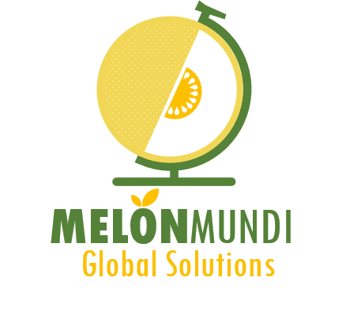
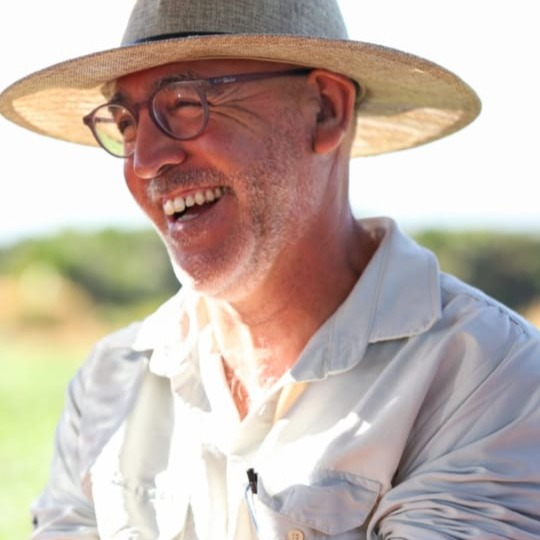
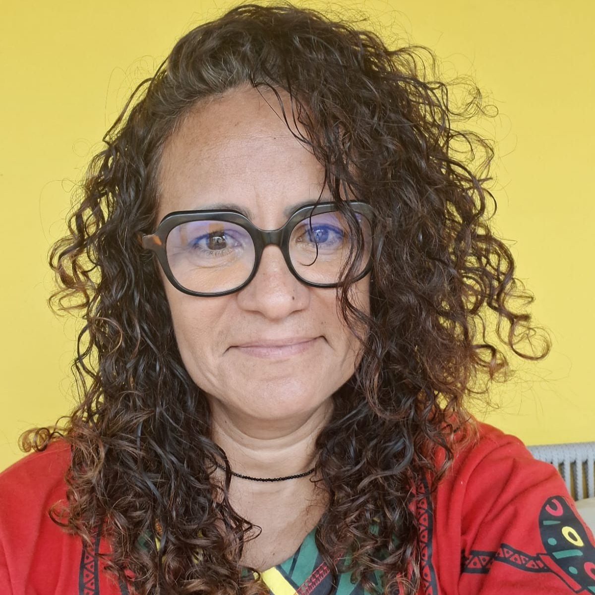
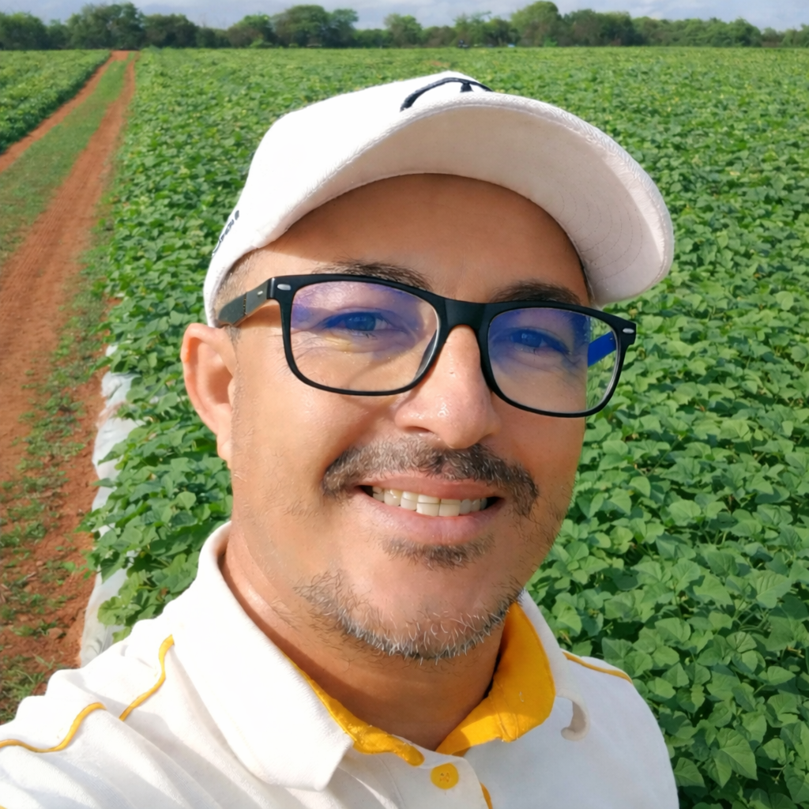
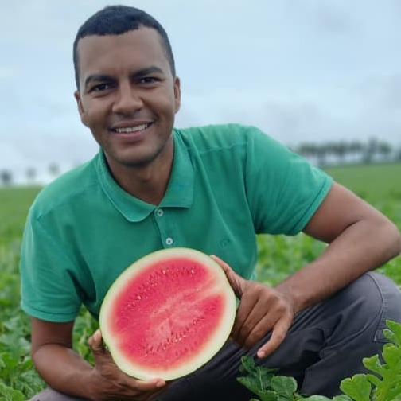

::: {.column-screen .about-hero}
::: {.column-body}

Quem somos

<h1>Um grupo multidisciplinar com dedicação exclusiva às cucurbitáceas</h1>

Atuamos de forma integrada em toda a cadeia produtiva de melão, melancia e abóbora, unindo ciência, experiência de campo e tomada de decisão baseada em dados — do planejamento da fazenda ao transporte e à pós-colheita.

:::
:::

::: {.column-screen .screen-band}
::: {.column-body}

3culturas de cucurbitáceas

5profissionais no time

100%foco em melão e melancia

P&Dpesquisa aplicada em campo

:::
:::

::: {.column-screen .screen-white}
::: {.column-body}

O que nos define

<h2 class="section-title reveal">Nossa forma de trabalhar</h2>

Projetos conduzidos com rigor técnico e conclusões que se traduzem em decisão prática, sempre com foco em produtividade, sustentabilidade e rentabilidade.

<article class="value-card">

<i class="fa-solid fa-seedling"></i>

<h3>Especialização</h3>

Dedicação exclusiva às culturas de melão, melancia e abóbora — e não a um portfólio genérico de culturas.

</article>

<article class="value-card">

<i class="fa-solid fa-map-location-dot"></i>

<h3>Planejamento</h3>

Acompanhamento do planejamento da fazenda até o transporte e a pós-colheita, com o mesmo time em todas as etapas.

</article>

<article class="value-card">

<i class="fa-solid fa-chart-line"></i>

<h3>Base técnica</h3>

Suporte técnico fundamentado em dados coletados no campo, experiência prática e rigor científico.

</article>

<article class="value-card">

<i class="fa-solid fa-check-double"></i>

<h3>Conclusão técnica</h3>

Projetos desenhados para chegar a conclusões sólidas sobre manejo, com número e justificativa por trás de cada recomendação.

</article>

<article class="value-card">

<i class="fa-solid fa-handshake-angle"></i>

<h3>Consultoria agrícola</h3>

Apoio ao manejo, à tomada de decisão e à evolução técnica das equipes que conduzem os projetos em campo.

</article>

<article class="value-card">

<i class="fa-solid fa-microchip"></i>

<h3>Tecnologia própria</h3>

Desenvolvemos a plataforma, os simuladores e os aplicativos que usamos no dia a dia — e os disponibilizamos no Acervo.

</article>

:::
:::

::: {.column-screen .screen-primary}
::: {.column-body}

Propósito

<h2 class="section-title section-title-light reveal">Nossa essência</h2>

<article class="essence-card">

<i class="fa-solid fa-bullseye"></i>

<h3>Missão</h3>

Promover o desenvolvimento de projetos em cucurbitáceas mais competitivos, humanos, saudáveis e rentáveis, transformando conhecimento em resultados concretos.

</article>

<article class="essence-card">

<i class="fa-solid fa-eye"></i>

<h3>Visão</h3>

Ser referência em pesquisa, consultoria e desenvolvimento de tecnologias para a produção de cucurbitáceas, gerando valor contínuo aos nossos clientes.

</article>

<article class="essence-card">

<i class="fa-solid fa-gem"></i>

<h3>Valores</h3>
<ul class="essence-values">
<li>Independência</li>
<li>Integridade</li>
<li>Honestidade</li>
<li>Rigor técnico</li>
</ul>
</article>

:::
:::

::: {.column-screen .screen-white}
::: {.column-body}

Marca

<h2 class="section-title reveal">Nossa identidade visual</h2>

A logomarca representa a abrangência global dos nossos serviços. As cores refletem a cultura de maior importância para o grupo — o melão — e o globo simboliza as ramas do meloeiro sustentando o mundo.

:::
:::

::: {.column-screen .screen-accent}
::: {.column-body}

Time

<h2 class="section-title reveal">Conheça quem faz a MelonMundi</h2>

Agronomia, campo, pesquisa, tecnologia e gestão trabalhando no mesmo projeto.

<article class="team-card">

<h3>Luis Álvarez</h3>
Fundador e Diretor

Coordenador de projetos, orientador técnico e consultor agrícola de campo.

</article>

<article class="team-card">

<h3>Juliana Carla</h3>
Administração e Finanças

Engenheira Civil, responsável por administração, finanças e projetos.

</article>

<article class="team-card">

<h3>Marlenildo Melo</h3>
Engenheiro Agrônomo

Responsável por desenho experimental, análise de dados e implementação de tecnologias da informação.

</article>

<article class="team-card">

<h3>Geinilson Oliveira</h3>
Técnico em Agropecuária

Avaliador de campo, monitor técnico em MIPD e assistente de Pesquisa &amp; Desenvolvimento.

</article>

<article class="team-card">

<h3>Francisco Eliton</h3>
Avaliador de Campo

Assistente de Pesquisa &amp; Desenvolvimento.

</article>

:::
:::

::: {.column-screen .screen-primary}
::: {.column-body}

<h3>Conheça o Acervo MelonMundi</h3>

Biblioteca técnica, simuladores, aplicativos e capacitação reunidos em um único login.

<a class="btn btn-mm btn-mm-amber" href="https://acervo.melonmundi.com"><i class="fa-solid fa-arrow-right-to-bracket" aria-hidden="true"></i> Entrar no Acervo</a>
<a class="btn btn-mm btn-mm-outline-light" href="index.qmd"><i class="fa-solid fa-house" aria-hidden="true"></i> Voltar à página inicial</a>

:::
:::
